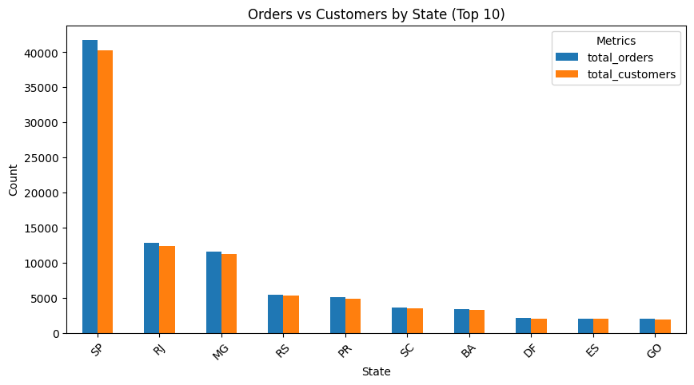
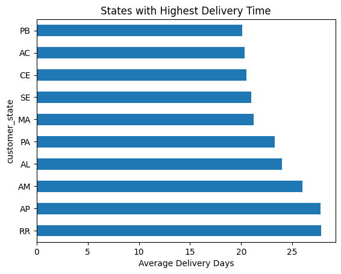
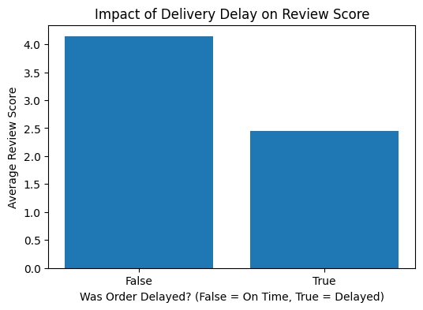

# 📊 E-Commerce Operations & Customer Experience Analysis

  
  
  
  
  

---

## 📌 Project Overview
This project analyzes an e-commerce marketplace to understand key factors affecting **delivery performance, customer satisfaction, and revenue generation**.  

The objective is to identify **operational inefficiencies, customer behavior patterns, and business opportunities** using data-driven analysis.

---

## 🎯 Business Problem
E-commerce platforms often face challenges such as:
- Delayed deliveries  
- Poor customer experience  
- Revenue leakage due to inefficiencies  

This project aims to:
- Improve delivery performance  
- Enhance customer satisfaction  
- Optimize business operations  

---

## 🛠️ Tools & Technologies

| Tool | Purpose |
|---|---|
| Python | Data Analysis |
| Pandas | Data Cleaning |
| NumPy | Numerical Operations |
| Matplotlib | Data Visualization |
| Seaborn | Statistical Visualization |
| Jupyter Notebook | Analysis Workflow |
---

## 🗂️ Dataset Description
The project uses multiple relational datasets merged using:

- `customer_id`
- `order_id`

### Main Datasets

| Dataset | Description |
|---|---|
| Orders Dataset | Order status & delivery details |
| Customers Dataset | Customer demographics |
| Products Dataset | Product categories |
| Payments Dataset | Payment details |
| Reviews Dataset | Customer review scores | 

---
# 🧩 ER Diagram

---
## 🔄 Project Workflow (Step-by-Step)

### 🧩 Step 1: Data Understanding
- Explored multiple datasets and relationships using ER Diagram  
- Identified key entities: customers, orders, delivery  

👉 **Impact:** Built a strong foundation for relational analysis.

---

### 🧹 Step 2: Data Cleaning
- Checked missing values and inconsistencies  
- Handled null values appropriately  
- Standardized formats (dates, categories)  

👉 **Impact:** Ensured high-quality, reliable data for analysis.

---

### 🔗 Step 3: Data Merging
- Merged datasets using `customer_id`  
- Created unified dataset for analysis  

👉 **Impact:** Enabled end-to-end customer and order analysis.

---

### 📊 Step 4: Exploratory Data Analysis (EDA)

Performed analysis on:

#### 👥 Customer & Geographic Analysis
- Customer distribution by location  
- Regional demand patterns  

#### 📦 Order & Delivery Analysis
- Order status distribution  
- Delivery delays and performance  

#### 💰 Revenue Analysis
- Revenue trends  
- High-performing segments  

👉 **Impact:** Identified patterns in customer behavior and operations.

---

### 📈 Step 5: Visualization
- Used **Matplotlib & Seaborn** for insights  
- Created plots for:
  - Order status distribution  
  - Customer location trends  
  - Delivery performance  

👉 **Impact:** Translated data into clear visual insights.

---
# 📊 Orders vs Customers by State

### 🔍 Insight

- São Paulo (SP) dominates both orders and customer count.
- Certain states contribute significantly higher business volume.
- Reveals regional market concentration and target regions.
---
# 💰 Top Selling Products & Revenue Analysis

### 🔍 Insight

- Some categories generate high sales volume but lower revenue.
- High-revenue categories reveal profitable business segments.
- Helps identify top-performing product categories.
---
# 🚚 States with Highest Delivery Time

### 🔍 Insight

- Certain states experience significantly longer delivery times.
- Delivery inefficiencies impact operational performance.
- Highlights regions requiring logistics optimization.
---
# ⭐ Impact of Delivery Delay on Customer Reviews

### 🔍 Insight

- Delayed deliveries drastically reduce customer review scores.
- Operational inefficiencies directly affect customer satisfaction.
- Demonstrates the business impact of logistics delays.
---
## 💡 Key Insights
- Significant number of delayed or non-delivered orders impacting customer experience  
- Certain regions show higher order concentration → key target markets  
- Operational inefficiencies directly affect customer satisfaction  
- Order status distribution highlights process gaps  
- Delayed deliveries negatively affect customer satisfaction.
- São Paulo contributes the highest business volume.
- Product categories vary significantly in profitability.
- Logistics inefficiencies are concentrated in specific states.
- Delivery performance directly impacts customer reviews.
---

## 🚀 Business Recommendations
- Improve logistics and delivery processes to reduce delays  
- Focus on high-demand regions for targeted marketing  
- Optimize order processing pipeline to reduce cancellations  
- Enhance customer experience through faster delivery and better service
- Focus marketing on high-demand states
- Prioritize high-profit product categories
---

## 📈 Final Outcome
- Performed **end-to-end data analysis on e-commerce operations**  
- Identified **key operational inefficiencies and customer trends**  
- Delivered **actionable business insights and recommendations**  

👉 **Impact:** Demonstrated ability to solve real-world business problems using data.

---

## 🎯 Conclusion
This project showcases strong skills in:
- Data cleaning & preprocessing  
- Exploratory data analysis (EDA)  
- Data visualization  
- Business problem solving  

It highlights how data can be leveraged to **improve operational efficiency and customer experience in e-commerce**.

---

⭐ *If you found this project useful, feel free to star the repository!*
